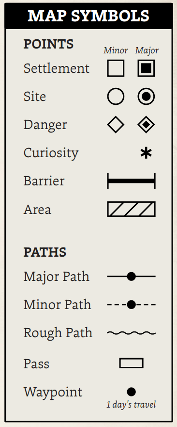
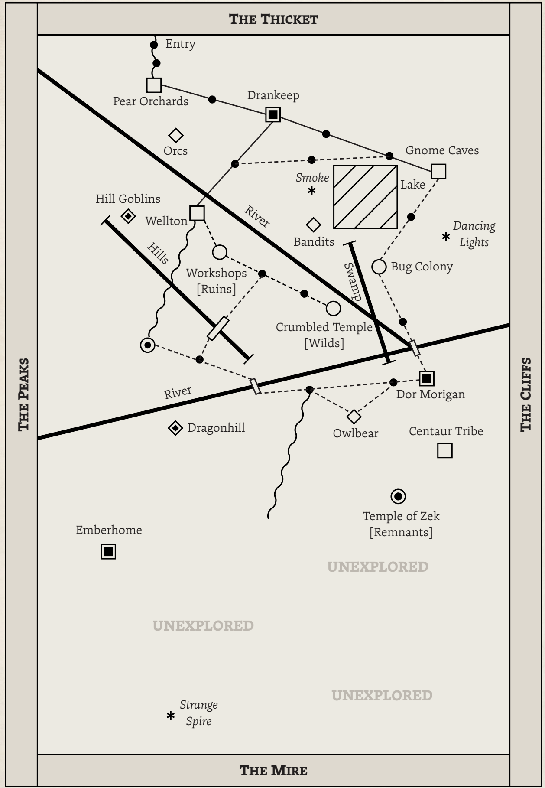

# 🗺️ МАПИ РЕГІОНІВ (*Region Maps*)

Регіональна мапа Grimwild починається з квадратів уздовж кожного кордону:  
- на заході — майже непрохідні гори,  
- на сході — довге скелясте узбережжя,  
- на півночі — густий ліс,  
- на півдні — небезпечні болота.  

А всюди між цим — **туман**, який не можна перетнути: він веде у одну з трьох реальностей, і немає способу дізнатися — в яку саме.  

Це створює обмежену, але цілковито невідому пісочницю для початку дослідження. Ви входите з одного боку, прокладаючи шлях у туман. Звідти починається дослідження. Витрачайте жетони, щоб:  

- **1 жетон:** малі точки (*minor points*) та малі шляхи (*minor paths*).  
- **2 жетони:** великі точки (*major points*) та великі шляхи (*major paths*).  
- **3 жетони:** цікавинки (*curiosities*), бар’єри (*barriers*) та області (*areas*). Також може додати МГ (безкоштовно), щоб оживити мапу, попросивши гравця додати їх або зробивши це самостійно.  
- **Безкоштовно:** небезпечні шляхи (*rough paths*) — додаються вільно, але вони складні й небезпечні для подорожі. Також безкоштовно можна додавати **перевали (*passes*)**.  
  **Контрольні точки (*waypoints*)** додає МГ. Кожна позначає **1 день подорожі** цим шляхом.  

---

### 📍 Коли ви додаєте щось на мапу
Завжди давайте назву чи мітку. Це може бути кілька слів або повна назва. Якщо не певні, зверніться до **Горнил (Crucibles)** на с. 88 для натхнення. Можна також позначити як [Залишки], [Дикі землі], [Руїни], щоб уточнити, якій реальності воно належить.  

### 🛤️ Коли ви малюєте шлях
МГ додає контрольні точки (точки = дні подорожі). Великі шляхи мають рідше розставлені точки, а малі — частіше. У небезпечних шляхів контрольних точок може й не бути, тоді доведеться лише здогадуватися про тривалість подорожі.  

---

## 📑 Список усього, що можна додати на мапу

- **Поселення (*Settlement*):** місця, де живуть люди — міста, племена, села.  
- **Місце (*Site*):** цікаві точки — підземелля, руїни, унікальні природні об’єкти.  
- **Небезпека (*Danger*):** ворожі чудовиська, небезпечна природа чи вороги.  
- **Цікавинки (*Curiosity*):** незрозумілі, але інтригуючі знаки або інформація для дослідження.  
- **Бар’єр (*Barrier*):** перешкоди для подорожі — річки, гори, урвища. Можна перетнути лише небезпечними шляхами або перевалами.  
- **Область (*Area*):** велика природна територія з єдиною темою — озеро, болото, пустеля.  
- **Великий шлях (*Major Path*):** добре доглянуті дороги чи торгові маршрути.  
- **Малий шлях (*Minor Path*):** менші стежки — лісові, мисливські, ігрові.  
- **Небезпечний шлях (*Rough Path*):** складна й небезпечна місцевість — зарослі стежки, кам’янисті дороги, пересохлі русла.  
- **Перевал (*Pass*):** мости, тунелі, гірські проходи.  
- **Контрольна точка (*Waypoint*):** позначає 1 день подорожі (верхи чи за звичайних умов).  

---

## 🗺️ Початок створення регіональної мапи

Почніть з одного кордону й використайте хід *Розширення мапи (Expand the Map)*.  
МГ малює небезпечний шлях у туман, після чого проведіть 1–2 раунди *Expand the Map*.  

Додавайте фракції та деталі до мапи й кампанії за потреби. (Див. Горнило фракцій на с. 88).  

---
## 🔖 Символи мапи

